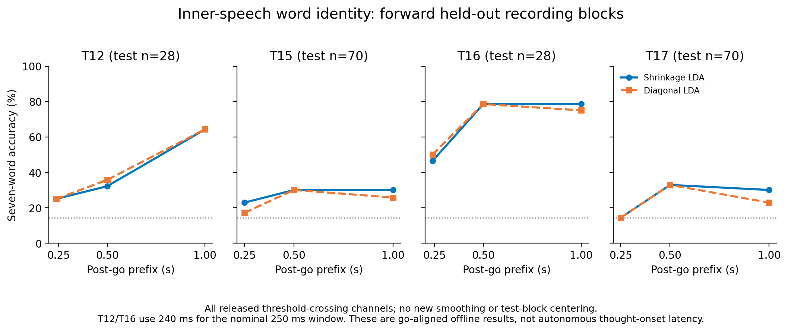

# Inner-Speech Trigger Benchmark

[中文说明](README_zh.md)

A reproducible benchmark that asks two different questions of intracortical inner-speech data:

1. **Event-aligned content:** if an instructed expression onset is already known, how much word identity is available in the next 250, 500, or 1,000 ms?
2. **Autonomous output:** can the same simple models decide *when* to emit a word while controlling false and repeated outputs?

The second question is the harder and more useful systems test. A decoder that classifies a cued, pre-segmented trial does not yet provide a continuously usable BCI.



## Main result

Using forward held-out recording blocks from four participants in the Stanford `interleavedVerbalBehaviors` dataset, shrinkage LDA reached the following seven-word inner-speech accuracies at 500 ms (chance: 14.3%):

| Participant | Accuracy | Correct / test trials |
|---|---:|---:|
| T12 | 32.1% | 9 / 28 |
| T15 | 30.0% | 21 / 70 |
| T16 | **78.6%** | **22 / 28** |
| T17 | 32.9% | 23 / 70 |

T16 reached 11/14 in each of two held-out blocks. This is promising evidence of short-window word information for one participant, not evidence of uniform performance or unrestricted thought decoding.

The fixed streaming rule did not pass the validation constraints with any non-mute threshold. The selected policy therefore emitted nothing and missed all 196 held-out inner-speech trials per model. Zero false outputs under a mute policy are reported as failure, not success.

## What is new here?

The classifiers are intentionally standard: shrinkage LDA and diagonal-covariance LDA. Sliding windows and thresholded state machines are also not new algorithms. The contribution is the **evaluation contract**:

- recording-order block splits instead of random trial mixing;
- train-only fitting and validation-only trigger selection;
- prefix features with no test-block centering or temporal smoothing;
- separate reporting of cued content decoding and autonomous triggering;
- all misses, wrong words, duplicate outputs, and non-target exposure retained;
- an explicit mute candidate so a policy cannot buy apparent safety and be called useful;
- participant- and block-level results, including negative results.

This repository should be described as a reproducible evaluation benchmark or methods case study. It is not a novel neural decoder and does not establish a new neuroscience mechanism. See [Novelty and claim boundaries](docs/NOVELTY_AND_SCOPE.md).

## Data

This repository does **not** redistribute neural data. Download `interleavedVerbalBehaviors.zip` from the official [Dryad dataset](https://datadryad.org/dataset/doi:10.5061/dryad.gf1vhhn1j), then extract it locally:

```bash
unzip interleavedVerbalBehaviors.zip
```

Expected archive:

- size: `777419058` bytes
- SHA-256: `19f90f09f2ea32f1428b7cc1c7dd8c0606dfbc988c57fcaf64aea03e77b9d409`

The data are anonymized by the source authors and identified only as T12, T15, T16, and T17. Follow the source dataset's terms and citation requirements. See [DATA.md](DATA.md).

## Reproduce

Python 3.11 is recommended.

```bash
python -m venv .venv
source .venv/bin/activate
pip install -e '.[test]'

inner-speech-benchmark \
  --data-dir /path/to/interleavedVerbalBehaviors \
  --output-dir reproduced_results

inner-speech-report \
  --output-dir reproduced_results \
  --figure-dir reproduced_figures

pytest
```

For the exact environment used to create the committed tables, install `requirements-lock.txt` instead and consult [`runtime_environment.json`](runtime_environment.json) for the Python, platform, BLAS, and thread settings.

The benchmark performs 96 model/task/window fits plus 49 within-training-block label permutations for every 500 ms task. Runtime depends on BLAS and CPU speed. Provider APIs are neither required nor called.

## Repository map

- `src/inner_speech_benchmark/`: data validation, feature extraction, LDA baselines, streaming trigger, and report generation.
- `results/`: complete derived CSV tables from the frozen neural run plus a sanitized aggregate table from the separate Jev pilot; no raw neural arrays or provider payloads.
- `results/manifest.json`, `results/COMPLETED.json`, `runtime_environment.json`, and `CHECKSUMS.sha256`: input/code hashes, completion state, exact runtime, and artifact integrity.
- `figures/`: publication-ready PNG and PDF summaries.
- `docs/METHODS.md`: exact split, feature, model, null, and streaming definitions.
- `docs/RESULTS.md`: participant-level results and limitations.
- `docs/JEV_EVALUATION.md`: where Jev was evaluated, what it helped with, and why it was not included in neural decoding.
- `tests/`: temporal-boundary and scoring invariants.

## Jev disclosure

[Jev](https://docs.typesafe.ai/introduction) was evaluated before this neural benchmark as a typed semantic prior in a separate synthetic interaction pilot. It reduced simulated user inputs under favorable context, but the gain was not unique relative to simpler or general-purpose alternatives and degraded when context was uninformative or misleading. Jev was therefore **not used** to extract neural features, fit neural classifiers, select test results, or process participant data. No neural data were sent to TypeSafe or any other model provider. Full aggregate results and scope are in [JEV_EVALUATION.md](docs/JEV_EVALUATION.md).

## Citation and attribution

Benchmark author and maintainer: [Dililianxice](https://github.com/Dililianxice). Machine-readable citation metadata are in [CITATION.cff](CITATION.cff).

If you reuse this benchmark, cite this repository, the original study, and the dataset:

> Dililianxice (2026). *Inner-Speech Trigger Benchmark* (v0.1.0). GitHub repository.

> Kunz, E., Abramovich Krasa, B., Kamdar, F., et al. (2025). *Inner speech in motor cortex and implications for speech neuroprostheses*. Cell. https://doi.org/10.1016/j.cell.2025.06.015

> Kunz, E., Abramovich Krasa, B., Kamdar, F., et al. (2025). *Inner speech in motor cortex and implications for speech neuroprostheses* [Dataset]. Dryad. https://doi.org/10.5061/dryad.gf1vhhn1j

The benchmark code, documentation, and figures are released under the [MIT License](LICENSE). Derived CSV and JSON tables are dedicated under [CC0 1.0](LICENSE-DATA.md). The original data and source study remain the work of their authors and are governed by their own terms.

## Responsible interpretation

The task uses prompted words and known task epochs. Word identity may contain cue memory, preparation, and production-related activity. “Go-relative latency” is not the onset time of a private thought. Four participants, one session each, and only 4–5 idle test trials per participant do not support claims about long-term safety, cross-day stability, or arbitrary thought reading.
