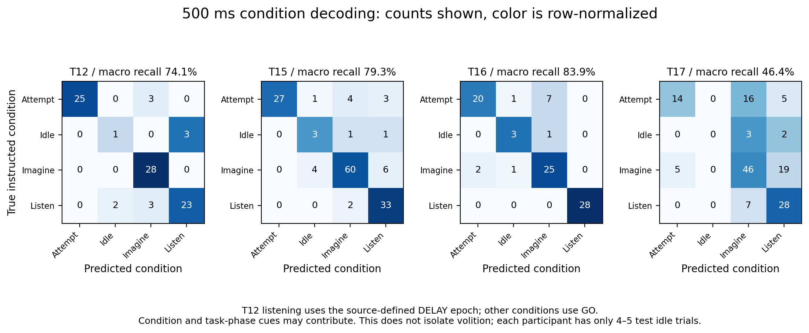

# Results

## Event-aligned imagined-word decoding

Shrinkage LDA accuracy on forward held-out blocks:

| Participant | 240/250 ms | 500 ms | 1,000 ms | 500 ms permutation mean |
|---|---:|---:|---:|---:|
| T12 | 25.0% | 32.1% | 64.3% | 12.7% |
| T15 | 22.9% | 30.0% | 30.0% | 14.2% |
| T16 | 46.4% | **78.6%** | **78.6%** | 13.3% |
| T17 | 14.3% | 32.9% | 30.0% | 14.7% |

Chance is 14.3%. Diagonal LDA at 500 ms yielded 35.7%, 30.0%, 78.6%, and 32.9%, respectively. T16's result therefore does not depend on one covariance estimator. It is still based on 28 test trials from one day.

## Instructed-condition decoding

At 500 ms, shrinkage LDA four-class macro recall was 74.1% (T12), 79.3% (T15), 83.9% (T16), and 46.4% (T17). The idle class contains only 4–5 test trials per participant and 8–15 seconds of exposure. This is too little evidence to estimate long-duration false-output safety.

## Streaming result

No non-mute threshold satisfied both validation constraints for either model in any participant. The false-output constraint included all recorded time outside imagined GO epochs, including delays and inter-trial intervals. The selected threshold was therefore `1.01` in all eight participant/model policies. On test data:

- emitted events: 0;
- fast-correct trials: 0;
- imagined trial misses: 196 per model;
- continuous non-target false events: 0 under the mute policy, across 358 s (T12), 515 s (T15), 425 s (T16), and 514 s (T17) of test exposure per model.

This is a failed autonomous-output system. The result does not prove that autonomous triggering is impossible. It shows that the fixed cue-trained LDA plus state-machine design did not transfer to continuous replay at a useful operating point.

## Files

- `metrics.csv`: all 96 model/task/window aggregate results.
- `predictions.csv`: every held-out trial prediction.
- `block_metrics.csv`: held-out results per recording block.
- `class_recalls.csv`: class-level denominators and recalls.
- `nulls.csv`: all within-training-block permutation outcomes.
- `stream_validation.csv`: every candidate threshold and selection flag.
- `stream_metrics.csv`: held-out streaming outcomes and exposure.
- `stream_trials.csv`: one row for every imagined test trial.
- `stream_events.csv`: valid empty event table for the selected mute policies.
- `audit.json`: cue mapping, participant bin size, channel count, block split, alignment, and exposure coverage.
